# E-Waste Monitoring System

## Overview

The E-Waste Monitoring System is a Python desktop application using Tkinter, designed to assist in managing electronic waste. This system helps users track electronic items, manage their lifecycle, and ensure proper disposal or replacement. It features an intuitive interface for adding, viewing, editing, replacing, and deleting electronic items.

## Features

- **Add Item**: Input details for new electronic items including name, serial number, purchase date, replacement date, and category.
- **Display Items**: View all added items in a structured table format.
- **Edit Item**: Modify details of existing items using their serial number.
- **Replace Item**: Update the replacement date and status of an item.
- **Delete Item**: Remove items from the system based on their serial number.
- **Clear Table**: Remove all items from the table view.
- **Category-Wise Display**: Filter and display items based on their category.
- **Search**: Locate items by name or serial number.

## Requirements

- **Python 3.x**: The application requires Python version 3.x.
- **Tkinter**: Included with Python; no separate installation needed.
- **datetime**: Standard Python library for handling dates.

## Usage

### Main Interface

The main window contains the following components:

- **Title**: Displays the application name with a stylized font.
- **Buttons**: Various action buttons for adding, monitoring, editing, replacing, deleting, clearing, and filtering items.
- **Search Bar**: Allows searching by name or serial number.
- **Table View**: Displays items with columns for Name, Serial Number, Category, Purchase Date, Replacement Date, and Status.
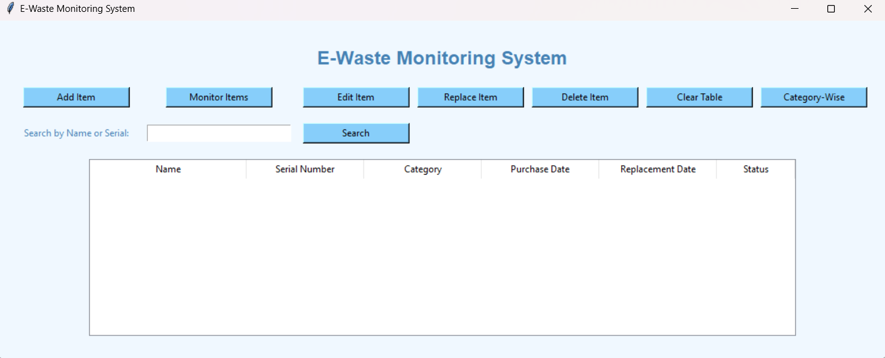

### 1. Adding an Item

1. Click the **"Add Item"** button.
2. Enter the item's name, serial number, category, purchase date, and replacement date.
3. Confirm the input and the item will be added to the list.
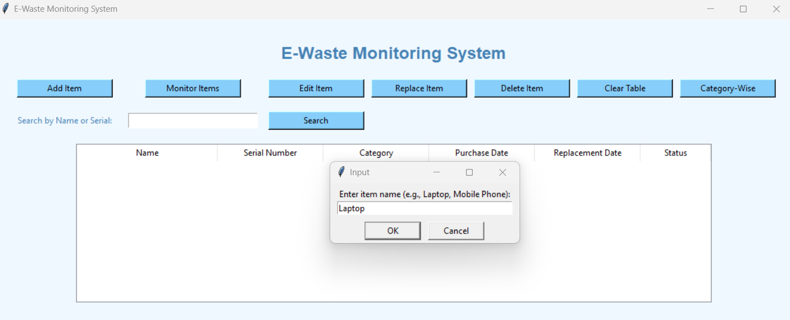
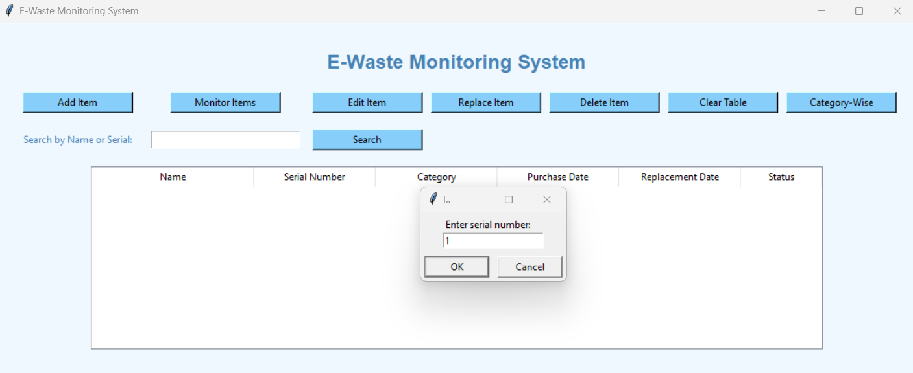

### 2. Displaying Items

Click **"Monitor Items"** to refresh and view all items currently in the system.
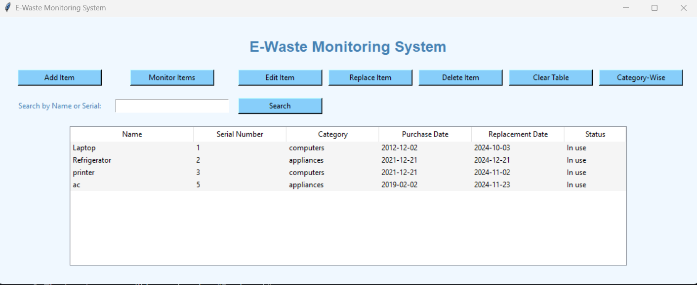

### 3. Editing an Item

1. Click the **"Edit Item"** button.
2. Enter the serial number of the item you want to edit.
3. Update the details as needed and save the changes.
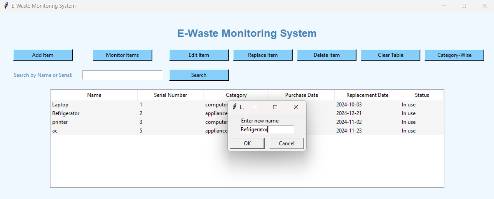

### 4. Replacing an Item

1. Click the **"Replace Item"** button.
2. Enter the serial number of the item to replace and the new replacement date.
3. The item's status will be updated to "Replaced."
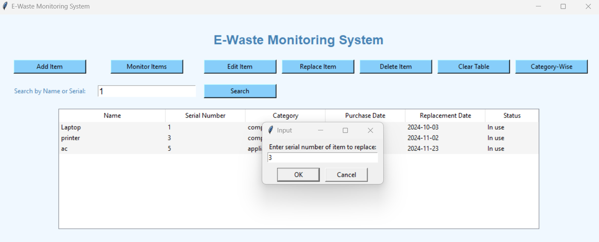
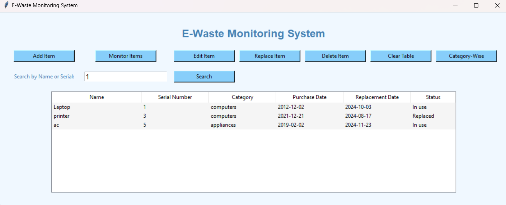

### 5. Deleting an Item

1. Click the **"Delete Item"** button.
2. Enter the serial number of the item to delete.
3. The item will be removed from the list.
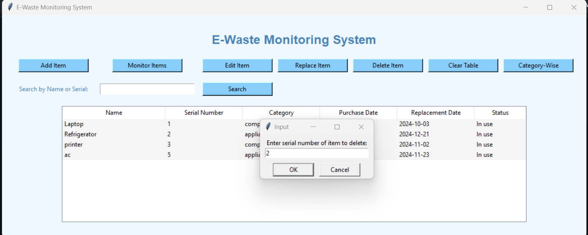
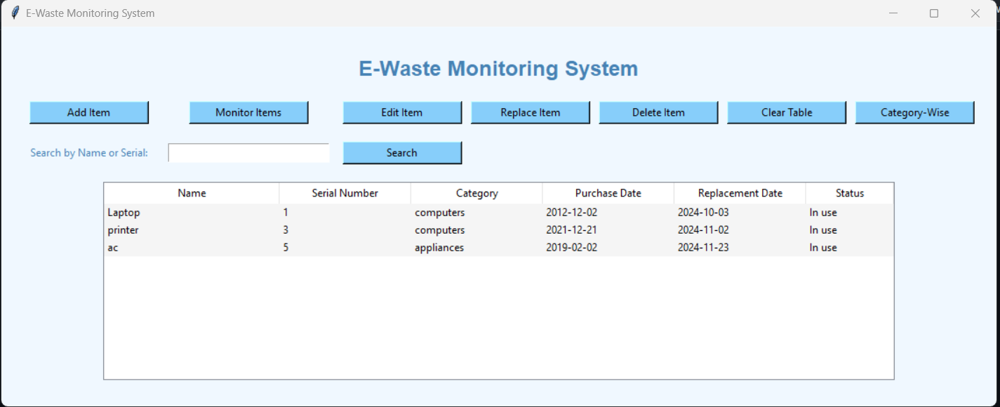

### 6. Clearing the Table

Click the **"Clear Table"** button to remove all items from the table view.
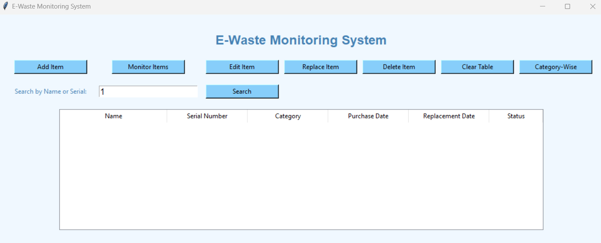

### 7. Filtering by Category

1. Click the **"Category-Wise"** button.
2. Enter the category you want to filter by.
3. The table will display only items in the selected category.
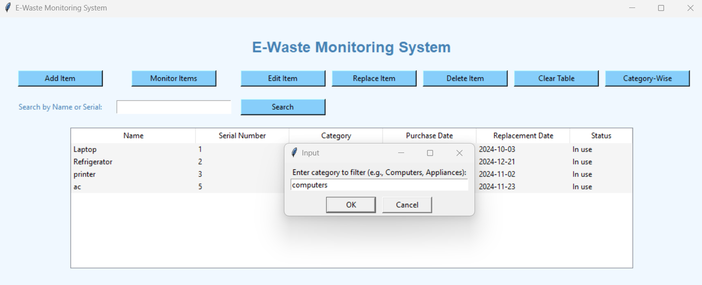
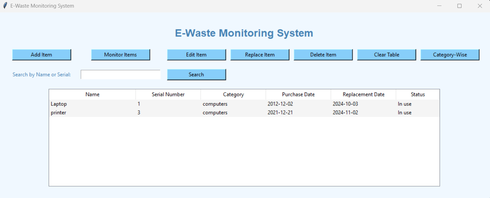

### 8. Searching for Items

1. Enter a search term in the **"Search by Name or Serial"** field.
2. Click the **"Search"** button to view items that match the search term.

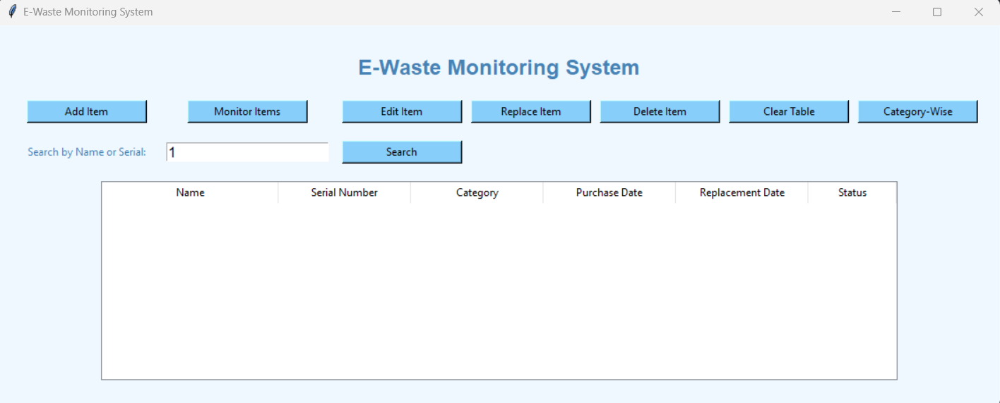
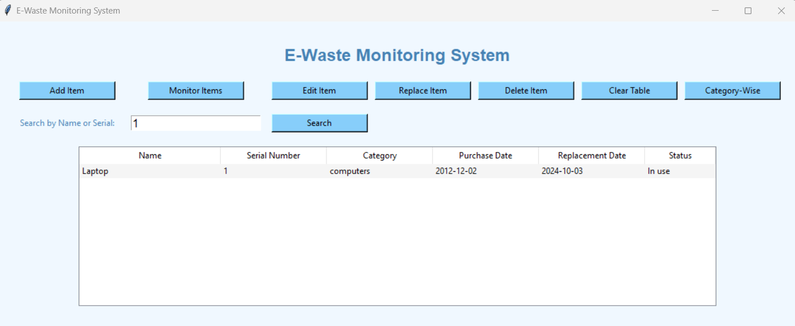

